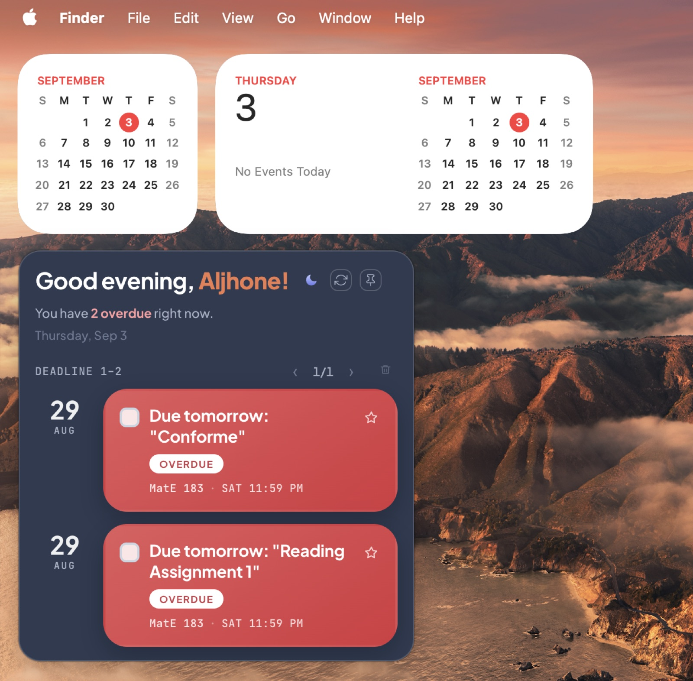
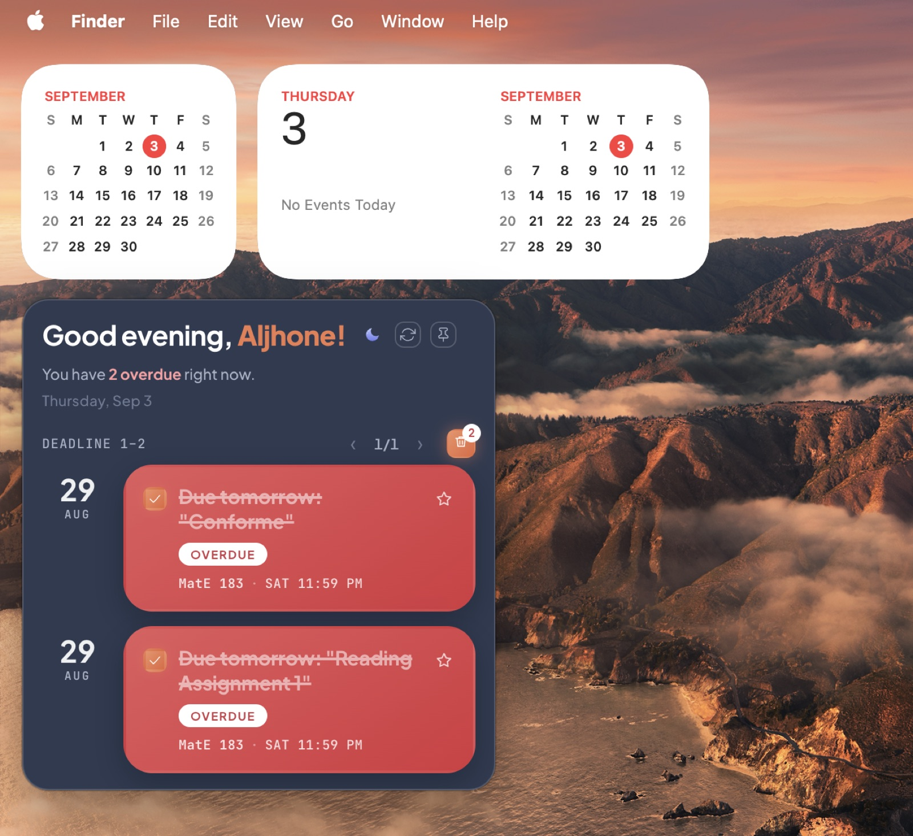
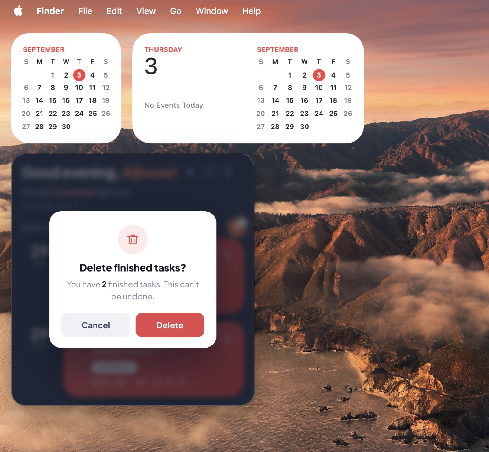
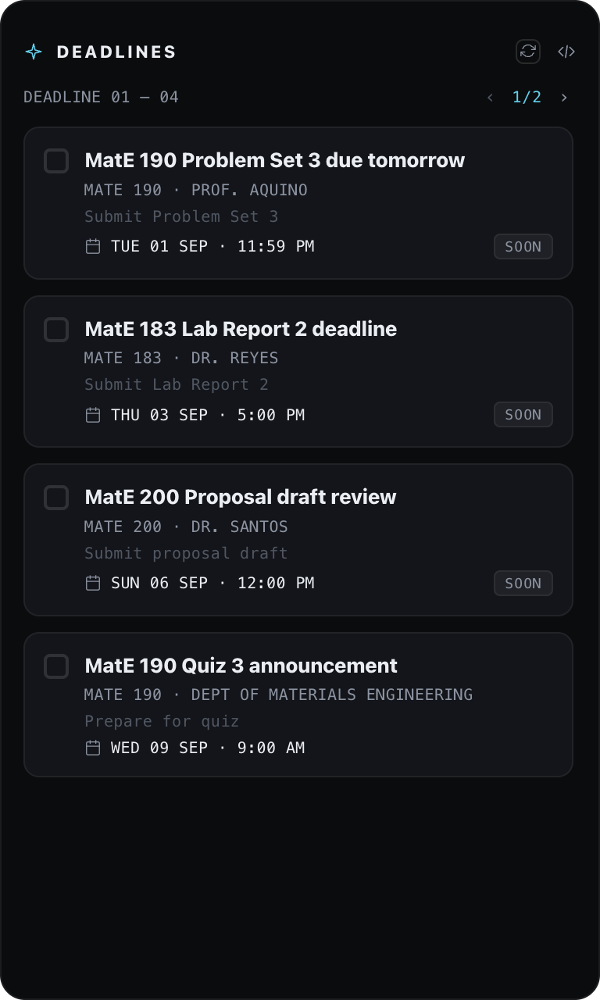
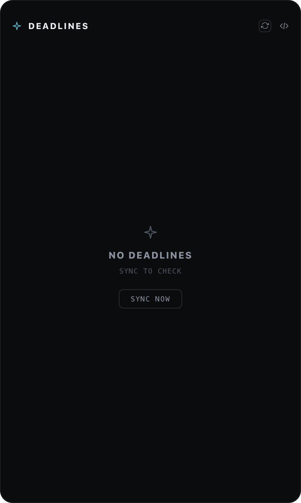

# 📌 Deadline Widget

**Never miss a deadline again.** 📬️ ➜ 🧠 ➜ 🗓️

Your academic deadlines, pulled **straight out of your Mail** into a floating macOS widget that actually gets them right — reads your inbox, filters the noise, extracts the real due dates, and surfaces them as calm urgency-tinted cards so you always know what's due *before* it's overdue.

> ⭐ **The widget that finally figures out what's actually due.** Stop drowning in "Due tomorrow" emails that scroll past unread. This watches your Mail, understands which messages are *real* academic deadlines (not spam), and keeps them in a corner of your screen until they're done. Dockless, always-on-top, and it never leaves your machine.

---

## 🖥️ Live — as it actually runs

Real captures, straight from a deployed macOS desktop (no mockups):

| Populated view | Overdue focus | Finished cleanup |
|---|---|---|
|  |  |  |
| Greeting + live clock + deadline cards, priority star | Urgency-tinted OVERDUE cards with real due times | Batch-delete finished tasks with a confirm modal |

*Greeting, dates, and a live time-of-day mark update in real time. Data shown is from the actual running widget on the author's machine.*

---

| | |
|---|---|
| **Platform** | macOS (arm64) · frameless desktop widget |
| **Shell** | Electron (transparent, draggable header, auto-height) |
| **UI** | React 18 + Motion · vanilla CSS, vendored variable fonts |
| **Backend** | Python Flask (local, 127.0.0.1) · SQLite |
| **Extraction** | LLM-driven deadline parsing (relative + absolute dates) |
| **Mail** | macOS Mail via AppleScript (local, read via app privacy) |

---

## ✨ What it does

Death by a hundred assignment emails is real. This widget takes the three that matter and puts them front-and-center:

- **Reads all recent mail** (not just unread) and filters out the noise — security alerts, "you have submitted" confirmations, meeting invites, lecture "material" pings.
- **LLM-extracts genuine deadlines** and resolves relative dates ("Due tomorrow", "Due Dec 5") into absolute due datetimes.
- **Surfaces them as cards** in a floating widget, color-coded by urgency: 🔴 **Overdue**, 🟠 **Due today / soon**, ⚪ **Upcoming**.
- **Conversational summary** — *"You have 1 overdue, 1 due today & 2 this week."*
- **Priority star × check off** — float the important one, mark done, and batch-delete finished tasks.
- **Lives as a widget, not an app** — accessory policy, no Dock icon, no Cmd-Tab.

---

## 🖼 Screenshots

*Populated view — three deadlines with urgency tints, priority star, checkbox, live clock tooltip:*



*Empty state — clean "sync to check" when there's nothing due:*



> All data shown is **dummy/sample** (generic subjects, fictional senders, example.edu). Real data stays local and private.

---

## 🧠 How it works

```
 macOS Mail (AppleScript)
        │  read recent mail
        ▼
 Python backend (Flask @ 127.0.0.1:8766)  ← SQLite (emails.db)
        │  1. fetch + pre-filter (drop security alerts / confirmations /
        │     meetings / material pings — keep genuine deadlines)
        │  2. LLM extract: subject, course_code, sender, deadline_date,
        │     action_summary (resolves "Due tomorrow" → absolute)
        │  3. write to SQLite
        ▼
 /api/cards  →  React UI (Electron renderer, file://)
        │  mapApiCard => card  (category_type, source, etc.)
        ▼
 Floating widget — urgency-tinted cards, priority star, pagination
```

**The contract** between backend and UI is stable and intentionally small:

```js
{
  id, email_id, subject, course_code, sender,
  deadline_date, action_summary, status, created_at
}
```

- `mapApiCard` derives `category_type` (`COURSE` vs `ANNOUNCEMENT`) and `source` from `course_code`.
- `deadline.js` holds **Safari-safe manual date/urgency parsing** (`OVERDUE` / `TODAY` / `SOON`) — no fragile `new Date(string)` reliance.

### Why a local backend?
Extraction needs an LLM call and a persistent store. Keeping it as a small local Flask + SQLite process (spawned by Electron, cleaned up on quit) means the widget stays self-contained, offline-capable, and private — nothing leaves your machine.

---

## 🎨 Design system

"Warm, personal briefing." Slate-navy canvas, terracotta accent, status-tinted bubbles, and a bold time-of-day greeting with your first name.

| Token | Value | Use |
|---|---|---|
| `--bg` | `#2F3A51` | Slate-navy canvas |
| `--accent` | `#ED7C52` | Terracotta accent (pin / checked / priority) |
| `--st-overdue` | `#E25B5E→#D6353F` | Overdue bubble |
| `--st-urgent` | `#F0946A→#E2663F` | Due-soon bubble |
| `--featured-bg` | `#14161F` | Priority date block |

- **Type:** Plus Jakarta Sans (UI) + JetBrains Mono (data) — vendored variable fonts, offline.
- **Window:** frameless, transparent, 360px, **height hugs content** (renderer reports height → main resizes, no dead void).
- **Motion:** time-mark pulse, card lift, modal fade — all `prefers-reduced-motion`-aware.
- Full token spec in [`DESIGN.md`](DESIGN.md).

---

## 🚀 Getting started

### Run locally (dev)
```bash
# backend (Python 3.11+, venv)
cd backend
python3 -m venv .venv && .venv/bin/pip install -r requirements.txt
.venv/bin/python api.py --port 8766

# frontend (node)
cd ../frontend
npm install
npm run build        # or: npm run dev for the Vite dev server + electron
npm start
```

### Package the dockless `.app`
```bash
cd frontend
npm install
npm run pack:dir     # -> frontend/release/mac-arm64/Deadline Widget.app
```

### Install at login (launchd)
See [`macos/install.sh`](macos/install.sh) — it deploys the launcher to a TCC-safe spot (`~/Library/Application Support/deadline-widget/`) and loads the `com.deadline.widget` LaunchAgent so the widget starts at login and auto-revives on crash. *(Edit the `DEADLINE_PROJECT_DIR` and `.app` paths in the templates for your machine.)*

---

## 🗂 Project structure

```
email-deadlines-widget/
├── backend/            # Flask + SQLite + Mail fetch + LLM extraction
│   ├── api.py          # 127.0.0.1:8766 — /api/health, /api/cards, /api/sync, /api/cards/<id>/check
│   ├── db.py           # SQLite layer (emails.db — local, private)
│   ├── extract.py      # LLM prompt + date-resolution rules
│   ├── mail_fetch.py   # Mail pre-filter (drop noise, keep deadlines)
│   └── schema.sql      # schema
├── frontend/           # React + Vite + Electron
│   ├── src/            # App, Header, Cards, icons, deadline.js helpers, mockData
│   ├── electron/       # main.js (shell) + preload.js (IPC)
│   └── electron-builder.yml  # dockless .app (LSUIElement)
├── macos/              # launchd launch agent + install.sh
├── DESIGN.md           # full design system spec
└── docs/               # screenshots
```

---

## 🔒 Privacy

- **Everything runs locally.** Mail is read on your machine; the backend + SQLite + LLM extraction happen locally. No email data is shipped anywhere.
- **Real data never touches this repo.** `backend/data/`, `backups/`, and the real fixture are **gitignored**. Any screenshots/products show **dummy** data only (generic courses, `example.edu` senders).
- The widget runs as a **dockless accessory** (`LSUIElement`) — it stays out of your Dock and Cmd-Tab, and only reads Mail under macOS app privacy.

---

## 🧪 Tests & verification

- `docs/verify.sh` — runs the backend against a fixture DB and checks `/api/cards`.
- Headless UI checks via Playwright/WebKit (the render pipeline is verified against the real contract).

---

## ✅ Roadmap

- [x] Packaged, dockless `.app` (LSUIElement, launchd auto-start)
- [x] Read all recent mail + deadline pre-filter
- [x] LLM date resolution (relative → absolute)
- [ ] Configurable hotlines/source overrides
- [ ] Multi-account / calendar-aware dedupe
- [ ] Custom widget icon + `.icns`

---

*Built as a personal desktop productivity tool. Designed & engineered end-to-end.*
